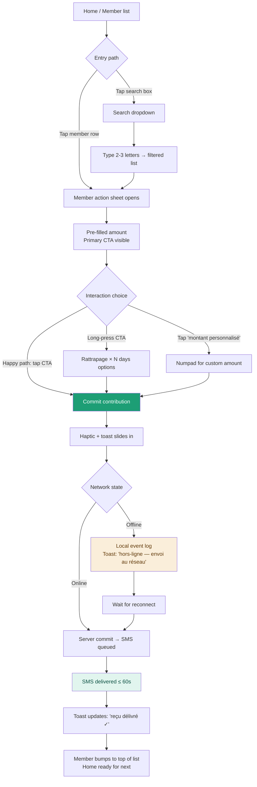
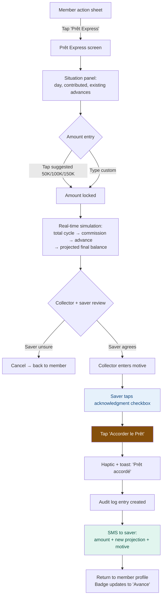
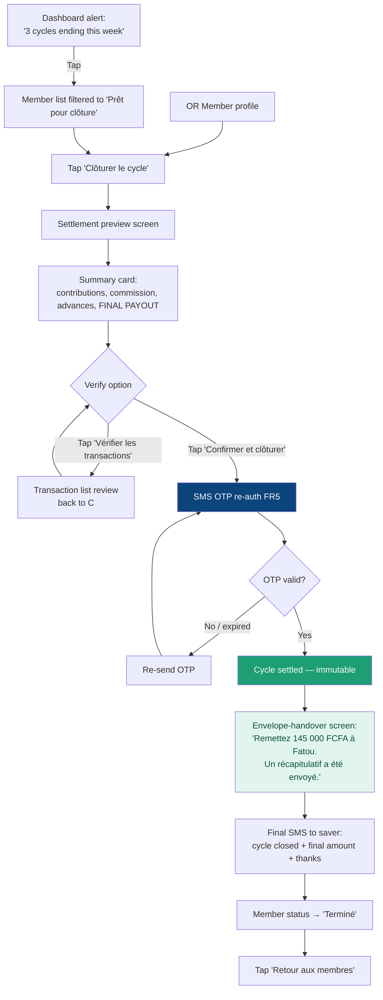
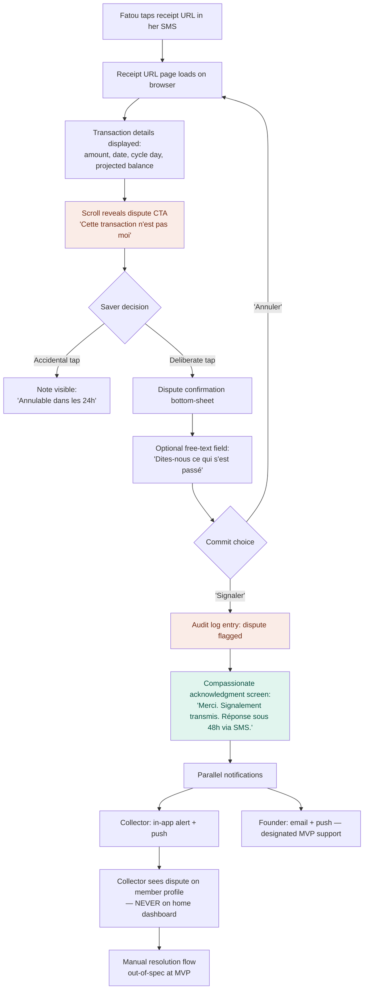
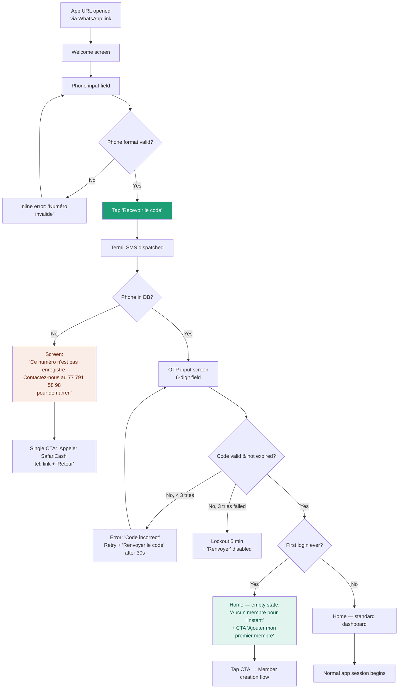

# UX Design Specification — SafariCash

**Author:** Mamadou
**Date:** 2026-04-18

---

<!-- UX design content will be appended sequentially through collaborative workflow steps -->

## Executive Summary

### Project Vision

SafariCash is not an app for collectors. It is the digital layer of a trust-transfer ritual that has existed in West African informal savings for generations. Every day, a collector walks a route. Every day, cash leaves a saver's hand and enters the collector's pocket. Every day, the saver remembers the amount. SafariCash's UX carries the weight of that remembering — and must make the digital layer of this ritual feel at least as solid, as human, and as proximity-aware as the paper notebook it replaces.

### Target Users

**Primary persona (paying customer):**
*Ibrahim Sow*, 34, collector in Grand-Dakar — 80+-saver daily route, Android smartphone, technically literate but not sophisticated. Operates in outdoor conditions: sun glare, ambient noise, standing, frequent one-handed use, mid-range device on 3G. Budget per transaction: ~4 seconds before social friction with the saver begins. Mental model: paper notebook. Success criterion: his route grows from 80 to 150 members without the tool breaking him.

**Secondary personas (non-paying end-users):**
*Fatou Diallo*, 42, market vendor in Médina — **feature phone (Nokia)**, reads SMS, does not install apps, semi-literate (relies on niece for longer-form reading). Never authenticates in the system; the phone number is her identity.
*Moussa Koné / Aminata Ba*, smartphone-enabled savers — data access, WhatsApp-aware, will consult the receipt URL when a doubt arises but otherwise trusts the SMS at face value.

**Tertiary persona (operational):**
*The founder*, acting as designated MVP support contact for FR33b dispute notifications. Needs signal-to-noise discipline in alerts: one ping per real dispute, zero false alarms.

### Key Design Challenges

1. **Speed–trust tension.** A collector transaction must complete in ≤ 5 seconds (NFR-P1) yet involves money the saver will remember to the franc. Too fast and the interaction feels careless; too slow and a 150-member route collapses. The *confirmation moment* is where this tension is resolved or broken.
2. **The feature-phone saver experience.** SMS content is a first-class UX surface, not an afterthought. 160-character discipline, NFR-A6 ASCII constraint, unknown French literacy floor, no interactivity. The receipt URL is a fallback surface, not a default — and it must render on a borrowed device by a third party (family member).
3. **Dispute flow (FR33b) as relational design.** A saver tapping *"Cette transaction n'est pas moi"* is a relational event, not a form submission. The UX must be compassionate, reversible (against accidental taps), traceable (audit log per NFR-S6), and must avoid premature conflict escalation while guaranteeing the signal lands.
4. **Offline uncertainty.** A collector operating for up to 24 hours offline needs to know *always* what is confirmed, what is pending, and what is at risk. The connectivity indicator (FR41) is a continuous reassurance — or, if designed poorly, a continuous anxiety source.
5. **Sensitive-operation re-authentication (FR5, NFR-S4).** Cycle settlement, bulk delete, and data export each require a fresh SMS OTP. If the re-auth friction lands at the wrong moment (e.g., mid-settlement in front of a waiting saver), it undermines the trust the product was about to deliver. The re-auth needs to feel protective, never annoying.
6. **Consent, deletion, opt-out as human moments.** Saver opts out of receipts (FR32), saver requests deletion (FR48), collector edits a phone number. These are regulatory requirements, but UX-wise they are trust ceremonies. Checkbox-style implementation misses the human dimension.
7. **Scale without feel change.** The member list at 50 entries and at 150 entries must feel like the same product. Search, status filtering, and information architecture bear the weight of this invariance.

### Design Opportunities

1. **The SMS receipt as a brand moment.** Every transaction generates a 160-character micro-billboard in the saver's inbox. Most fintechs treat these as transactional plumbing. SafariCash can treat them as a daily brand-love surface — predictable cadence, clear typography-in-plaintext, reassuring copywriting. This is SafariCash's hidden UX canvas.
2. **The settlement-day ritual.** Day 30 is the emotional climax of the cycle. Rather than a form submission, this is a small ceremony — app recap, collector counts, saver receives her envelope and a final SMS. Design this as the *moment of crystallised trust*, not a screen flow.
3. **Dispute as dialogue, not complaint.** FR33b is an opportunity to redefine how fintech handles disagreement. The saver's flag triggers a compassionate acknowledgment (*"nous enquêtons, vous serez recontactée"*), a clear timeline, and a fair resolution. The first dispute that resolves well is worth ten successful cycles in word-of-mouth.
4. **Offline-as-empowerment.** A persistent, elegant offline indicator that communicates *"I've got you"* rather than *"Red alert, error, error"*. Design offline as a feature, not a failure state — a badge the collector wears with confidence.
5. **Ibrahim's first 10 minutes.** Onboarding → bulk import → first transaction. If Ibrahim emerges from this sequence feeling like he has just hired a competent assistant, the product is won. If he emerges feeling like he has just been handed another tool to learn, the product is lost.

### Open UX Questions (surfaced during discovery, to resolve before detailed design)

| # | Question | Why it matters | Owner |
|---|---|---|---|
| **UXQ1** | What is the literacy floor of feature-phone savers? | Directly shapes SMS copywriting complexity and receipt URL content strategy | Founder (from field interviews during pilot) |
| **UXQ2** | Founder alert volume tolerance for FR33b disputes — real-time or digest? | Drives alert UX design; affects operational cost for founder | Founder |
| **UXQ3** | Pilot collector onboarding — human-assisted (by founder / ami-collecteur) or self-serve from day one? | Determines depth of in-app onboarding flow required at MVP | Founder |
| **UXQ4** | Wave as explicit UX reference — acceptable, or pivot to Orange Money / MTN MoMo anchor? | Shapes the visual and interaction reference library | Founder |
| **UXQ5** | What other apps are installed on the typical pilot-collector's phone? | Calibrates the baseline of interaction fluency we inherit | Founder (field interviews during pilot) |
| **UXQ6** | Founder's personal reference apps to pattern-match against? | May surface non-obvious inspiration outside my reference palette | Founder |

## Core User Experience

### Defining Experience

The defining interaction of SafariCash is the **daily contribution entry**: a collector selects a known member from their route, confirms a pre-suggested daily amount, and within seconds the saver's phone vibrates with a verifiable SMS receipt. This single loop is repeated 50–150 times per collector per working day. If this interaction is seamless, the product succeeds; if it introduces friction, the product cannot scale and cannot earn trust.

All other flows (member CRUD, advance, cycle settlement, reporting, dispute, consent) are instrumental — they exist to support, protect, or enrich this core loop. The UX hierarchy reflects this: the contribution entry is the only interaction allowed to occupy the app's primary tap path from its home surface.

### Platform Strategy

- **Delivery:** Installable PWA at MVP (React 18 + Vite PWA Plugin), mobile-first, targeting Android 8+ and iOS 13+. Native transition at 24 months anticipated but not designed against at this stage.
- **Primary interaction mode:** Touch, one-handed, outdoor, 3G.
- **Secondary surface for savers:** SMS-primary (feature-phone aware, plain 7-bit ASCII, no emojis, ≤ 160 characters); receipt URL page rendering on any browser without auth as fallback / verification surface.
- **Offline guarantee:** 24 hours at MVP. Every screen in the collector path must function correctly offline, with no silent failures and no degraded correctness.
- **Device features leveraged:** Vibration on confirm (NFR-A2 parity); IndexedDB for offline queue; contacts picker (opt-in) for bulk member import; *no* biometric, push, or geolocation at MVP.
- **Platform features deliberately not leveraged:** desktop, tablet-primary, CLI, voice — SafariCash is mobile-phone only at MVP.

### Effortless Interactions

These are the interactions the user should never have to *think* about. If the user pauses to consider what to do next, we have failed:

- **Contribution entry.** Pre-suggested amount (from member's daily_amount); single tap to confirm; haptic feedback on commit; SMS dispatched; home surface returns instantly for the next member. Zero data entry in the happy path.
- **Member lookup.** Typing the first 2–3 letters of a member's name filters a 150-entry list to ≤ 5 results in under 300 ms (NFR-P2). Names sort by recency-of-interaction, not alphabetical, so the member just visited is almost always first.
- **Connectivity awareness.** The collector never opens a settings screen to know the network state. The top-bar badge is persistent, glanceable, and communicates state without demanding attention.
- **Amount formatting.** FCFA thousands are always grouped with a non-breaking space (French locale, NFR-L3). The collector never sees raw integers in the UI.
- **Projection arithmetic.** The app computes balances in real time (NFR-P5 ≤ 16 ms). The collector never performs mental math in front of a saver.

### Critical Success Moments

These are the moments where the product either earns trust or loses it. Each one deserves specific attention from the visual and interaction designers:

- **First transaction (Ibrahim's day 1).** The collector signs up, imports 80 members, and performs his very first transaction. If this sequence completes in under 25 minutes end-to-end and the first transaction takes < 5 seconds, the product has won its paying customer.
- **First SMS receipt (Fatou's first cycle).** The saver's Nokia buzzes before the collector has walked three stalls. She reads a 160-character SMS that is clear, reassuring, and verifiable. This is the first branded moment; it must feel unmistakably SafariCash.
- **Dispute flag (FR33b first use).** A saver taps *"Cette transaction n'est pas moi"* on a receipt URL page. The UX must hold this moment gently: a compassionate acknowledgment screen, a predictable timeline, a clear reversal option in case of accidental tap. This interaction sets the tone for how SafariCash handles disagreement for the rest of its existence.
- **Cycle settlement day (Day 30).** Projected balance equals settled balance to the franc. The collector hands over the envelope. The saver receives a final SMS that confirms the cycle is closed. This is the emotional climax of the product's value proposition.
- **Re-authentication at the wrong moment.** When the collector triggers settlement, the OTP re-auth (FR5, NFR-S4) arrives. If this lands during a standing-up-in-front-of-a-saver moment, the friction must feel protective, not bureaucratic. Loading state matters; copy matters.
- **Saver-side opt-out (FR32).** A saver asks to stop receiving SMS. The collector or saver triggers the opt-out. The UX must confirm respect without shame, and must clearly explain the traceability trade-off.

### Experience Principles

Five principles that bind every downstream design decision. When a visual designer or developer faces a trade-off, they defer to these:

1. **Preserve the ritual.** SafariCash digitises the daily cash handover; it does not replace it. The app is always present alongside the human interaction, never instead of it. Screens stage the ritual — they do not perform it.
2. **Speed is kindness.** A four-second transaction is not sloppy; it is respect for both the collector's route and the saver's market day. Slowness is the default enemy, and slowness that pretends to signal care is the worst kind.
3. **Visible proof, always.** Every state mutation (transaction, advance, deletion, cycle settlement) produces a visible, pointable trace — for the collector in the app, for the saver via SMS, for the regulator via audit log. No action is ever invisible.
4. **Offline-first dignity.** A collector operating offline must never feel punished, degraded, or uncertain. The app treats connectivity loss as a normal operating mode, not an error. Pending-sync states are communicated with confidence, not apology.
5. **Consent-as-ceremony.** Opt-ins, opt-outs, deletions, and permission grants are trust moments, not form fields. The UX treats each of them as a small ceremony with clear language, reversible choices, and never-dark-pattern defaults. Legal compliance is a floor; human respect is the ceiling.

## Desired Emotional Response

### Primary Emotional Goals

**For Ibrahim (collector, primary user):** *confidence and quiet pride*. He is a professional who has run a collection route for three years. SafariCash must amplify his professional pride, not overwrite it. The feeling we aim for immediately after his first transaction: *"I just hired a competent assistant"*, never *"I am learning a new app."*

**For Fatou (saver, secondary user):** *trust, now verifiable*. She has trusted Ibrahim for years on relational grounds. SafariCash must not replace that trust — it must make it checkable, auditable, self-evident. The SMS and receipt URL must feel like tools she reaches for, not surveillance she tolerates.

**For the founder (tertiary, dispute recipient):** *awareness without overload*. One ping per real signal. Predictable cadence. Never faux-urgent.

### Emotional Journey Mapping

**Ibrahim's arc (across the first 30-day cycle):**

| Moment | Ideal feeling | UX responsibility |
|---|---|---|
| Downloads app from WhatsApp link | Curious, slightly cautious | Landing page reassures without over-promising |
| Creates account + bulk-imports 80 members | Relief, then pride | Onboarding completes in < 25 min; import progress is tangible |
| First live transaction | Flow | Transaction completes in < 5 s, SMS lands visibly |
| Day 15 saver dispute (paper would be humiliating) | Composure and authority | Member profile displays timestamped truth in one tap |
| Offline period (3G outage mid-route) | Steady reassurance | Connectivity indicator communicates safety, not alarm |
| Day 30 settlement | Accomplishment | Projected = settled to the franc; no mental math in front of saver |
| Returning for cycle 2 | Anticipation, now habit | Home surface remembers the route's rhythm |

**Fatou's arc:**

| Moment | Ideal feeling | UX responsibility |
|---|---|---|
| First SMS receipt | Surprise, then verification | SMS is clear, unpatronising, verifiable by her own memory |
| Repeated receipts over 10 days | Cumulative trust | Cadence is predictable, format is identical |
| First need for advance | Agency | Collector shows simulation; she sees the exact number |
| Receipt URL (week 3, on niece's phone) | Satisfaction | URL renders on any browser, shows what she already knew |
| Day 30 settlement | Vindication | Received amount matches her day-10 SMS projection to the franc |
| If a dispute ever occurs | Validated, heard | Dispute flag produces a human acknowledgment, not a form |

### Micro-Emotions

**Design FOR:**

- *Confidence* (Ibrahim) — projections always visible in context; confirmation gestures are decisive and physical (haptic).
- *Pride* (Ibrahim) — professional aesthetic; sparse animation; no gamification; no cheerful badges for "you did 50 transactions!"
- *Dignity* (Fatou) — SMS tone is adult-to-adult; no "félicitations" for paying what she promised; no educational framing.
- *Reassurance* (Ibrahim) — offline and sync states feel green-adjacent, never red-alarm.
- *Trust* (both) — numbers across app and SMS always reconcile; never a surprise at day 30.
- *Composure* (Ibrahim) — re-auth moments (FR5) feel like a vault door opening, not a bureaucratic interruption.

**Design AGAINST:**

- *Anxiety* — no silent failures; no spinners without named context; no loaded-but-stale data.
- *Humiliation* — dispute flow (FR33b) never shames the collector publicly; notifications land privately and compassionately.
- *Overwhelm* — member list never renders more than needed; search and recency sort do the filtering.
- *Patronization* — saver-facing SMS never explains *how to read a number*; French tone is peer-to-peer.
- *Exclusion* — feature-phone saver receives the same information fidelity as smartphone saver; URL is an add-on, not a privilege.

### Design Implications

Connections between target emotion and concrete UX decisions (these will be revisited in every downstream design stage):

| Emotion | UX implementation direction |
|---|---|
| Confidence (Ibrahim) | Pre-suggested amounts, inline balance projection, haptic confirmation, undo affordance within 5 s of a contribution |
| Pride (Ibrahim) | Professional typography (system-ui already per design system), restrained animation, commission visibility as earned-value narrative |
| Dignity (Fatou) | SMS copy in peer-voice French; receipt URL in structured-but-plain typography; no marketing content in receipt body |
| Flow (Ibrahim) | Single-screen contribution entry; auto-dismiss confirmation toast; immediate return to member list with recency boost |
| Reassurance (Ibrahim) | Persistent connectivity badge in green/amber/grey (never red); pending-sync count shown as information, not warning |
| Trust (both) | Projection math shown in context at every relevant moment; settlement recap mirrors in-cycle projections exactly |
| Composure (Ibrahim) | Re-auth screens have reassuring copy (*"nous vérifions que c'est bien vous"*); short-loop OTP delivery; no multi-factor stack |
| Against Anxiety | Every state named; no anonymous errors; offline is a named state, not a missing state |
| Against Humiliation | Dispute lands privately to collector + founder; collector sees dispute status on member profile, never on home dashboard |
| Against Overwhelm | Member list virtualised; status filters persistent; search is primary navigation, not fallback |

### Emotional Design Principles

Five principles that complement the experience principles from the previous section. When a designer faces an emotional trade-off, they defer here:

1. **Pride over playfulness.** The collector is a professional. Treat him like one. No confetti, no "level up" metaphors, no cartoons.
2. **Respect over hand-holding.** The saver has been managing money longer than this app has existed. Never explain basic arithmetic. Never use educational tone. Speak peer-to-peer.
3. **Calm over alarm.** Warnings and errors are designed to reassure before they inform. Red exists only for irreversible destruction (delete confirmation, dispute escalation). All other states are communicated with neutral or warm tones.
4. **Match the mental math.** The app must never contradict what a user has already calculated in their head. If it does, the app is wrong — not the user. Projections and settlements are the same number; receipt and recap are the same number; offline and online views reconcile to the same number.
5. **Ceremony over checkboxes.** Consent, opt-out, deletion, dispute — these are emotional moments disguised as legal requirements. We treat them as ceremonies: clear language, reversible choices, never-dark-pattern defaults. The regulatory floor is the starting point, not the ceiling.

## UX Pattern Analysis & Inspiration

### Inspiring Products Analysis

**Wave (Senegal, WAEMU mobile money)** — the cultural anchor of UEMOA fintech UX. Calm, dense, action-first. No marketing content in transactional flows. Sub-second transaction execution is the user's mental benchmark — SafariCash must feel at peace next to Wave, not in competition. *Lesson:* West African collectors and savers have already been trained to expect clean, fast, text-light fintech interfaces. We inherit that expectation, we don't have to create it.

**Superhuman (email for professionals)** — speed as a feature, not a by-product. Every interaction budgeted, measured, and shaved. Professional aesthetic with zero gamification. Respects the "serious user" without patronising. *Lesson:* an app can be fast AND dignified. The two are not in tension when design is intentional.

**Linear (project management)** — minimal, opinionated, dense without clutter. Keyboard shortcuts, recency-based lists, quiet animations. *Lesson:* pro interfaces don't need decoration to feel trustworthy; they need structural clarity.

**M-Pesa (Kenya, SMS-first heritage)** — the gold standard for SMS-as-trust-artifact. M-Pesa receipts became cultural objects in Kenya: savers photographed them, kept them, used them as legal evidence. *Lesson:* the SMS format matters more than the SMS content. Predictable structure, identical every time, short enough to screenshot in one tap.

**WhatsApp (used by collectors for SafariCash distribution link)** — its "recent conversations at top" pattern is cognitively native to target users. *Lesson:* we piggyback on a learned pattern for the member list (recency sort, not alphabetical).

**Monzo (UK, early era)** — transactional receipts that feel human without crossing into patronising. *Lesson — with caution:* adopt the warmth of their receipt writing, but reject the "millennial London" tone. Our register is French West Africa, peer-to-peer.

### Transferable UX Patterns

**Navigation & hierarchy:**

- **Wave-style bottom tab navigation** with oversized primary action buttons (already in the mockup, affirm). Four tabs max; the primary action (new transaction) lives as a FAB or central-prominent CTA, not buried in a menu.
- **Linear-style breadcrumb-free depth.** Collector never gets lost because the app is never more than 2 taps from the home surface.

**Lists & data display:**

- **WhatsApp-style recency-sort member list.** Just-visited members float to the top, making the next transaction one scroll away. This is the core of the "150-member route feels like 50" promise.
- **Linear-style dense card design.** Member cards show amount + day + status without visual fluff. The mockup already goes in this direction.

**Feedback & confirmation:**

- **Superhuman-style instant confirmations.** Transaction commit → haptic + toast + immediate return to list. No modal, no "are you sure", no friction in the happy path. Undo window replaces confirmation modal.
- **WhatsApp-style sync-state indicator** (sent / delivered / read metaphor). Adapted as: queued offline → syncing → server-confirmed → SMS-delivered. The collector glances and knows.

**SMS design (saver-facing):**

- **M-Pesa-style rigid structure.** Every SMS has the same template, same field order, same width. Predictability is the trust generator.
- **Monzo-style warmth without over-warmth.** First SMS: short greeting, transaction summary, receipt URL. Subsequent SMS: no greeting, just data. Humanity on first touch, efficiency on repetition.

**Onboarding:**

- **Superhuman / Linear-style minimal onboarding.** Sign up → import members → first transaction. No marketing carousels, no feature tours. The app teaches itself by being used.

### Anti-Patterns to Avoid

- **Gamification creep** (Robinhood-style). No confetti on the 100th transaction. No "level up" for hitting 100 members. Ibrahim is a professional, not a game character.
- **Feature-phone SMS noise.** All-caps SMS headers, marketing footers, emoji clusters, multi-message series, survey links in every SMS. Fatou's Nokia filters SMS ruthlessly; we must respect the medium.
- **Fintech-bro aesthetic.** Dark mode primary, neon accents, coin animations, "your crypto of the week". Wrong emotional register entirely for the UEMOA informal sector.
- **Preachy / educational tone.** *"Félicitations Madame, vous avez cotisé aujourd'hui !"* is patronising to someone who has managed her market stall for 20 years. Our tone is peer-to-peer, never teacher-to-student.
- **Modal hell and gated views** (typical African banking apps). Re-auth only where PRD requires (FR5: settlement, bulk delete, export). Never a surprise login prompt mid-route.
- **Scope drift toward wallet-everything.** Revolut / PayPal-style "add bill pay, add investment, add crypto". SafariCash must stay a tool. Every feature addition passes through "does this support Ibrahim's next transaction?" — if no, it's out.
- **Silent / anonymous errors.** *"Something went wrong. Try again."* is a betrayal of the *"offline-first dignity"* principle. Every failure state is named, timestamped, and contextualised.

### Design Inspiration Strategy

**What to adopt directly:**

- Wave's dense-but-calm layout philosophy.
- Superhuman's instant-confirmation feedback loop.
- WhatsApp's recency-sorted list pattern for members.
- M-Pesa's rigid SMS template structure.

**What to adapt:**

- Monzo's receipt warmth, but localised to West African French peer-voice — not British millennial.
- Linear's keyboard shortcuts → deferred to Growth (collectors work on mobile touch at MVP).
- Superhuman's command palette → out of scope (power-user features for later native transition).

**What to avoid entirely:**

- Robinhood gamification and any confetti-style animation.
- Revolut / PayPal horizontal feature expansion.
- Fintech-bro aesthetic (dark-mode-first, neon, crypto visual language).
- Instructional / patronising copy toward savers.
- Anonymous error states.

**Meta-principle:** SafariCash's design personality sits at the intersection of **Wave's calm authority**, **Superhuman's speed-as-respect**, and **M-Pesa's SMS-as-cultural-artifact**. If a designer or developer is ever unsure whether a pattern fits, they ask: *"Does this feel like Wave? Would Ibrahim trust it? Would Fatou be able to understand the SMS it produces?"*

## Design System Foundation

### Design System Choice

**SafariCash adopts a themeable design system built on Tailwind CSS + Radix primitives + shadcn/ui components**, with all components customised to the SafariCash brand palette and interaction patterns defined in this specification.

This is not an off-the-shelf design system consumed as-is. shadcn/ui's copy-paste architecture means we own every component in the codebase — no library lock-in, no version conflicts, no fighting framework opinions. Tailwind provides the utility layer; Radix provides accessibility primitives; shadcn/ui provides the initial component scaffolds we customise.

### Rationale for Selection

- **Stack alignment.** The project brief already commits to React 18 + TypeScript + Tailwind CSS + Framer Motion. shadcn/ui is purpose-built for this stack; introducing a different system (MUI, Ant, Chakra) would either fight Tailwind or replace it entirely.
- **Accessibility by default.** Radix primitives ship WCAG 2.1 AA-compliant behaviour out of the box (focus traps, keyboard navigation, ARIA attributes). This directly satisfies NFR-A1 without hand-rolling accessibility per component.
- **Performance alignment.** No runtime CSS-in-JS. No heavy component library bundle. Tree-shakeable, tiny footprint. Supports NFR-P3 (FMP ≤ 2.5 s on 3G mid-range Android).
- **Aesthetic neutrality.** shadcn/ui components arrive visually neutral — they don't impose a Material or Google aesthetic that would clash with SafariCash's calm-professional tone (the *"Pride over playfulness"* principle).
- **Ownership and customisation.** Copy-paste architecture means the SafariCash codebase owns the components. Customising the *"SUPPRIMER"* typed-confirmation dialog, the offline-status badge, the advance-simulation panel is a local code edit, not a theme-override file.
- **No lock-in.** If SafariCash later pivots to a different React framework, native transition (React Native at 24 months), or decides to swap primitives, nothing stops that migration.

### Implementation Approach

**Foundation layer:**

- **Tailwind CSS 3.x** with a custom `tailwind.config.ts` encoding the SafariCash palette (primary green #1D9E75, full tint / shade scale, semantic tokens for success / warning / error / info).
- **Tailwind theme tokens** for typography (system-ui family, type scale), spacing (4 px base grid, 44 px touch-target minimum), radii (consistent with mockup's 12-16 px card rounding), and shadows (subtle, not heavy).

**Primitive layer:**

- **Radix UI primitives** for all interactive behaviour: Dialog, Dropdown, Select, Toast, Switch, Tabs, Tooltip. These provide a11y and behaviour; we provide the visual skin.

**Component layer:**

- **shadcn/ui** component set as starting point — copied into the SafariCash repo under `src/components/ui/` — then customised aggressively to match the mockup (custom card styles, SafariCash-specific status badges, member row component, transaction entry surface, dispute flag UI).

**Animation layer:**

- **Framer Motion** for purposeful motion only — confirmation toasts, page transitions, advance-simulation reveal. Strict discipline: animation ≤ 200 ms, no parallax, no "delight" animations (*"Pride over playfulness"*).

**Component inventory (MVP):**

| Component | Source | Customisation level |
|---|---|---|
| Button (primary, secondary, destructive) | shadcn/ui | Re-skin to palette |
| Card | shadcn/ui | Heavy — match mockup member-card layout |
| Dialog | Radix | Re-skin; special variant for typed-confirmation delete |
| Select / Dropdown | Radix | Re-skin |
| Toast | Radix (sonner) | Haptic-paired for transaction confirm |
| Tabs (bottom nav) | Custom over Radix | Mockup-accurate |
| FAB | Custom Tailwind | Mockup-accurate |
| Input / Form | shadcn/ui | Re-skin for currency formatting (NFR-L3) |
| Badge (status) | shadcn/ui | Strict palette mapping (Actif / Avance / Terminé) |
| Connectivity indicator | Custom | Novel component; persistent header badge |
| Projection / Simulation panel | Custom | Novel component for FR24 advance flow |
| Dispute flag surface (receipt URL) | Custom | Mobile-web, no framework; plain HTML + Tailwind |

### Customisation Strategy

**Brand tokens (non-negotiable):**

- Primary colour: `#1D9E75` (SafariCash green) with derived 50–950 scale
- Secondary palettes: amber (`#854F0B` family), red (`#712B13` family — reserved for destructive / dispute), blue (`#0C447C` family — informational)
- Typography: `system-ui` stack (no custom font download; respects 3G budget)
- Corner radius: 12 px for cards, 16 px for primary buttons
- Spacing scale: 4 px grid

**Themeable through CSS variables** so that:

- Future Wolof / Bambara / Dioula UI variants (NFR-L2) can receive locale-specific type adjustments without code fork.
- White-label Vision-phase deployment (for IMFs / banks) can repaint tokens without touching component code.

**Accessibility overlay:**

- Every component ships with WCAG 2.1 AA contrast (≥ 4.5:1 text).
- Every interactive element respects 44 px minimum touch target (NFR-A2).
- High-contrast mode supported through OS-level preferences (prefers-contrast).

**What we explicitly DO NOT customise (to preserve upgrade paths):**

- Radix primitive internal behaviour (focus management, keyboard handling).
- shadcn/ui component structure (we override styles, not the component tree).
- Tailwind core utility generation (we extend config, we don't modify core).

## Defining the Core Experience

### Defining Experience

**"Tap Fatou. Confirm 5 000. Her Nokia buzzes. Walk on."**

This is SafariCash's defining interaction. A collector selects a known member, confirms a pre-suggested daily contribution, and before they've taken three steps away, the saver's phone vibrates with a verifiable SMS receipt. Elapsed time: < 5 seconds. Mental effort: zero. Social proof: intact.

If we nail this single sequence, the rest of the product exists in its shadow. If we miss it, no amount of polish elsewhere will save the product.

### User Mental Model

The collector does not import a "fintech app" mental model into SafariCash. He imports the **paper notebook model**:

1. Open the notebook
2. Flip to the member's page (visual pattern recognition, tabs)
3. Read their daily amount from the top of the page
4. Write the date and amount on today's row
5. *The saver watches him write — this is the social proof*
6. Close the notebook, move to the next saver

The digital version must satisfy all six of these micro-expectations. In particular, step 5 (saver visibility) is non-obvious but critical: a transaction where the saver does not see anything tangible feels like theft in progress. SafariCash replaces the paper-visibility with the **SMS vibration that lands before the collector walks away**. This is the single most important design decision in the core experience.

### Success Criteria

The core transaction succeeds if, without exception:

- **Time-to-done:** ≤ 5 s, app-open to toast displayed (NFR-P1, p95).
- **Decisions required:** 0. Amount is pre-filled. Confirmation is a single tap.
- **Mental math:** 0. The collector never performs arithmetic.
- **Saver social proof:** the SMS arrives on the saver's phone within 60 s (NFR-P4), ideally within 10 s on a good connection, ideally before the collector has walked to the next stall.
- **Confirmation modal:** 0. Replaced by a 5-second undo window in the post-commit toast.
- **Failure communication:** if the transaction fails to commit locally, the state is named explicitly (*"Hors-ligne — cotisation enregistrée, synchronisation en attente"*) and never silent.
- **Recency payoff:** the member just transacted moves to the top of the list immediately, making the next probable next-member reach one scroll away (WhatsApp pattern).

### Novel vs. Established Patterns

Most of the core experience rides on established mobile UX patterns. The novelty is not in the interaction vocabulary but in the **contextual combination** specific to the cash-collection ritual.

**Established patterns we adopt directly:**

- Tap-a-row-to-reveal-action (Gmail, Linear, Things).
- Toast with undo affordance (Gmail's "Undo Send" is the canonical reference).
- Haptic confirmation on commit (iOS / Android standard).
- Recency-sorted list (WhatsApp, Messages).
- Pre-filled form field with single-tap confirm (Apple Pay, Wave).

**Novel combinations (SafariCash-specific):**

- **Saver-side proof-of-transaction as primary confirmation.** The collector's in-app toast confirms the record; the saver's SMS confirms the transaction socially. We treat the SMS as a first-class UI element of this interaction, not a side-effect.
- **The "walk away" UX window.** The transaction is not considered successful until the saver's phone has buzzed. Design tolerates a 5-second gap between commit and SMS delivery, with a subtle indicator on the toast progressing from *"cotisation enregistrée"* → *"reçu envoyé ✓"*.
- **Undo-in-lieu-of-confirm.** Instead of a pre-commit *"are you sure?"* that costs 1–2 s on every transaction, we offer a post-commit 5-second undo. Net time saved on 150 transactions per day: 150–300 seconds (2.5–5 minutes) of avoided friction. The rare mistake is cheap; the routine case is fast.

**No genuinely novel interactions introduced.** Ibrahim should feel he already knows the app before opening it.

### Experience Mechanics

The detailed flow of the core transaction, step-by-step:

**1. Initiation — ≤ 1 tap from home surface.**

Two equivalent entry paths:

- **Path A (preferred for known members, recency-sorted list):** From the dashboard or member list, Ibrahim scrolls (rarely needed — recency sort puts the likely next member near top). He taps a member's row.
- **Path B (preferred for search-driven access):** Ibrahim taps the search box at the top of the list, types 2–3 characters of the member's name, taps the resulting row.

Both paths open the same **member action sheet** (a bottom-sheet modal, not a new screen). The action sheet is partial-height — the list remains visible behind, so Ibrahim never loses context.

**2. Interaction — 1 tap in happy path.**

The member action sheet displays:

- Member avatar and name.
- Pre-filled amount at the member's `daily_amount` with FCFA suffix.
- A primary CTA: *"Enregistrer cotisation — 5 000 FCFA"* (amount rendered in the button itself, not separately).
- A secondary row with: *"Rattrapage"* / *"Prêt"* / *"Montant personnalisé"* for edge cases.

Happy path: Ibrahim taps the primary CTA. One tap.

Edge paths:

- *Rattrapage*: long-press or secondary-row tap reveals "× 2 / × 3 / × 4 days" options, each pre-computed.
- *Prêt*: opens the advance flow (separate experience defined by FR24–FR25).
- *Montant personnalisé*: reveals a numeric keyboard for manual entry (rare case, < 5 % of transactions).

**3. Feedback — immediate, multi-channel.**

On tap:

- **Haptic:** instant vibration (medium intensity, NFR-A2 parity with the design system).
- **Visual (collector):** the action sheet dismisses with a 150 ms slide-out. A success toast slides in from the top of the home surface: *"✓ Cotisation enregistrée — reçu envoyé à Fatou"*.
- **Progressive confirmation:** the toast subtly updates over the next 10–60 s as the SMS status progresses (*"envoi..."* → *"reçu délivré ✓"*). If offline, *"hors-ligne — envoi au prochain réseau"*.
- **Social (saver):** within 60 s, Fatou's phone vibrates with the SMS. This is the interaction's true completion event.
- **List state:** the member row in the underlying list reorders to the top (recency sort) and shows an updated cycle progress bar.

**4. Completion — invisible, fast, resumable.**

Three seconds after commit, the home surface is fully settled. The toast auto-dismisses (with the undo affordance collapsing into the toast timeline). Ibrahim is free to tap the next member. He never navigated "back" because he never left the list.

**5. Error & edge handling — named, actionable, never silent.**

- **Offline commit:** the transaction enters the local event log. Toast reads: *"Cotisation enregistrée hors-ligne. Synchronisation au prochain réseau."* Nothing else changes in the UX — Ibrahim continues his route.
- **Sync failure post-reconnect:** the toast escalates to an amber banner on the member's row in the list with a *"retenter"* action. Never a red alarm.
- **Saver's SMS gateway fails:** the toast SMS-status indicator shows *"envoi échoué — retenter"*. Receipt is durable (stored), retryable, and visible on the member's profile.
- **Accidental tap on wrong member:** the 5-second undo window on the toast allows rollback. After 5 s, rollback requires the member profile's transaction-edit flow (FR10), which records an audit-log mutation (NFR-S6).

### Experience Invariants

These are hill-I-would-die-on UX invariants. Any proposed feature, refactor, or scope change that threatens one of these must be rejected or escalated to a product-level decision:

1. **One tap to commit** in the happy path. Non-negotiable.
2. **No pre-commit confirmation modal.** Undo replaces *"are you sure?"*.
3. **SMS visible to saver within 60 s** (NFR-P4 enforcement at UX level).
4. **The list is never left** for a transaction commit. Action sheets, not new screens.
5. **The toast tells the truth** about the actual state of the transaction (local, syncing, confirmed, SMS-delivered, SMS-failed). No optimistic lies, no silent degradations.

## Visual Design Foundation

### Color System

The SafariCash palette is already cristallised in the existing HTML mockup. This section codifies it as design tokens with semantic mapping, accessibility annotations, and usage rules.

**Primary brand anchor:**

| Role | Hex | Notes |
|---|---|---|
| Primary / SafariCash Green | `#1D9E75` | Primary CTA, brand anchor, success default |
| Primary Hover / Deep Green | `#16875F` | Button hover, primary gradient end-stop |
| Primary Dark / Text on Light | `#085041` | Headings and body text on light surfaces |
| Primary Tint / Subtle BG | `#E1F5EE` | Status-active badge background, subtle surfaces |
| Primary Ultra-Light / Subtle Stroke | `#F0FAF6` | Progress-bar base, hairline borders |

**Semantic palettes** (re-used across the mockup — promoted to tokens):

| Semantic | BG | Text | Accent | Usage |
|---|---|---|---|---|
| Success (default = primary) | `#E1F5EE` | `#085041` | `#1D9E75` | Active cycles, confirmations, positive states |
| Warning / Attention | `#FAEEDA` | `#633806` | `#854F0B` | Advance status, cycles-ending alerts, mild warnings |
| Destructive / Critical | `#FAECE7` | `#712B13` | `#E24B4A` | Delete confirmation, dispute-flag surface, irreversible states only |
| Informational / Neutral | `#E6F1FB` | `#0C447C` | `#B5D4F4` | In-context explanatory data, saver situation panel |

**Neutral scale** (for surfaces, text, borders):

| Role | Hex | Usage |
|---|---|---|
| Surface 0 (page) | `#F8F9F8` | App body background |
| Surface 1 (card) | `#FFFFFF` | Cards, modals, action sheets |
| Text / Primary | `#111111` | Member names, primary labels |
| Text / Secondary | `#666666` | Timestamps, meta-info |
| Text / Tertiary | `#AAAAAA` | Disabled tab labels |
| Border / Hairline | `rgba(29,158,117,0.15)` | Card borders (brand-tinted, not neutral grey) |

**Accessibility contrast audit (WCAG 2.1 AA — NFR-A3 ≥ 4.5:1 normal text):**

| Pair | Contrast | Verdict |
|---|---|---|
| `#085041` on `#FFFFFF` | 10.3 : 1 | ✅ AAA |
| `#111111` on `#F8F9F8` | 17.9 : 1 | ✅ AAA |
| `#666666` on `#FFFFFF` | 5.7 : 1 | ✅ AA |
| `#FFFFFF` on `#1D9E75` (primary button text) | 3.6 : 1 | ⚠️ Fails AA for body text; **acceptable for large/button text (≥ 18 pt or 14 pt bold, WCAG 1.4.3 large-text rule)**. Action: never place small body text on primary fill. |
| `#085041` on `#E1F5EE` | 9.4 : 1 | ✅ AAA |
| `#633806` on `#FAEEDA` | 6.8 : 1 | ✅ AAA |
| `#712B13` on `#FAECE7` | 9.1 : 1 | ✅ AAA |

**One flag to enforce:** the primary button text-on-green pair (3.6 : 1) is fine for the current button sizes (16 px/600 in the mockup) but would fail on smaller captions. **Rule:** primary-green is never used as a small-text background.

**Color-agnostic status rule (NFR-A4):** every status badge combines **colour + text label + icon position**. Never colour alone. Status mappings:

| Status | Badge colour | Label | Icon |
|---|---|---|---|
| Active | Success tint | "Actif" | — |
| With advance | Warning tint | "Avance" | — |
| Completed | Info tint | "Terminé" | — |
| Overdue (Growth) | Destructive tint | "En retard" | — |

### Typography System

**Font stack:** `system-ui, -apple-system, "Segoe UI", Roboto, "Helvetica Neue", Arial, sans-serif`

- No custom font downloaded (NFR-P3 FMP ≤ 2.5 s on 3G — zero font-load cost).
- Respects platform-native readability (Fatou's Nokia browser won't ever open the app but the principle propagates to the receipt URL page).

**Type scale** (4 px grid anchor, semantic names):

| Token | Size / Line-height | Weight | Usage |
|---|---|---|---|
| `display` | 24 px / 32 px | 700 | Dashboard hero, detail-hero name |
| `title-1` | 20 px / 28 px | 600 | Screen headers, section titles |
| `title-2` | 16 px / 24 px | 600 | Card titles, modal headers |
| `body-1` | 15 px / 22 px | 400 | Default body, member names, inputs |
| `body-2` | 14 px / 20 px | 400 | Secondary text, transaction list |
| `caption` | 13 px / 18 px | 500 | Timestamps, status labels |
| `overline` | 11 px / 16 px | 600 / uppercase / letter-spacing 0.08 em | Section cues ("Activité récente", tab labels) |
| `amount-large` | 32 px / 36 px | 800 | Amount display in transaction hero |
| `amount-inline` | 15 px / 20 px | 700 | Amount in buttons, cards |

**Hierarchy rules:**

- No more than **3 type sizes per screen**. Dense information competes with the "Speed is kindness" principle.
- Amounts always use a tabular-figure variant (`font-variant-numeric: tabular-nums`) so columns align vertically on member lists.
- FCFA suffix is **always the same weight** as the number, never smaller (the currency is not secondary — it's the unit).

**Readability targets:**

- Minimum body text: 14 px (never go below).
- Line length: constrained to ~45–60 characters on mobile.
- Line-height minimum: 1.4 × font-size for body text.

### Spacing & Layout Foundation

**Base unit: 4 px** (matches the mockup's implicit grid and Tailwind's default).

**Spacing scale** (Tailwind tokens):

| Token | Value | Common use |
|---|---|---|
| `space-1` | 4 px | Micro-padding inside icons |
| `space-2` | 8 px | Inner card padding, tight stacks |
| `space-3` | 12 px | Card gap, list-item internal gap |
| `space-4` | 16 px | Screen padding (horizontal), card body |
| `space-5` | 20 px | Section breaks, modal padding |
| `space-6` | 24 px | Hero padding, large section gaps |
| `space-8` | 32 px | Major section separation |

**Touch target minimum (NFR-A2):** 44 × 44 CSS px for all interactive elements. Applies to buttons, tab bar items, list-item tappable rows, and the FAB.

**Corner radii:**

| Element | Radius |
|---|---|
| Cards (member, form, transaction) | 16 px |
| Buttons (primary, secondary) | 14–16 px |
| Inputs, select | 12 px |
| Badges (status) | 8 px |
| FAB, avatars | 50 % (circular) |
| Toast | 12 px |
| Phone-device frame (mockup only) | 40 px |

**Layout grid:**

- **Single-column mobile-first.** No multi-column layouts at MVP (tablet and desktop are out of primary scope).
- **Screen padding:** 16 px horizontal, 24 px top (below system status bar).
- **Card gap:** 12 px vertical between sibling cards in a list.
- **Maximum content width:** none enforced — content fills the viewport. At tablet widths (≥ 600 px), content stays at ~480 px max-width and centres, with increased margins.

**Elevation and shadow:**

- **Flat-by-default.** Cards use a 1 px hairline border (`rgba(29,158,117,0.15)`) instead of heavy drop shadows. Supports the calm aesthetic.
- **Subtle lift on interactive feedback:** 4 px soft shadow (`0 4px 12px rgba(29,158,117,0.12)`) on hover/press only.
- **Heavier elevation reserved for:** primary CTA hover (`0 8px 20px rgba(29,158,117,0.3)`), FAB (`0 8px 20px rgba(29,158,117,0.4)`), toast (`0 12px 30px rgba(29,158,117,0.4)`).

### Accessibility Considerations

- **Contrast:** every typographic pair audited (table above). AA minimum for body text, AAA for headings where achievable without palette deviation.
- **Touch targets:** 44 × 44 CSS px minimum; enforced via component library (not per-design-decision).
- **Focus states:** every interactive element exposes a visible focus ring — 2 px primary-green outline with 2 px offset, satisfying WCAG 2.4.11 (Focus Not Obscured).
- **Screen reader support:** Radix primitives provide ARIA by default; custom components (connectivity badge, projection panel, dispute flag) must be hand-audited with VoiceOver and TalkBack (NFR-A5).
- **Prefers-reduced-motion:** every Framer Motion animation wrapped with a `prefers-reduced-motion: reduce` guard. Essential animations (toast slide) have non-animated fallbacks.
- **Prefers-contrast:** high-contrast mode detected; palette darkens hairline borders to `rgba(29,158,117,0.35)` and strengthens body text to `#000000`.
- **Text resize:** layout survives 200 % text-zoom without clipping (WCAG 1.4.4). Tested per screen before QA sign-off.
- **Colour-agnostic status:** status badges never rely on colour alone (see Color System → Color-agnostic status rule).
- **Receipt URL accessibility:** the saver-facing receipt URL page is Level A minimum (most users are on feature phones not hitting the URL; smartphone visitors get AA). Structured with proper headings and semantic HTML, no JavaScript required to read.

## Design Direction Decision

### Design Directions Explored

The SafariCash design direction was **pre-cristallised** during the PRD creation phase via a high-fidelity HTML mockup (`03-mockups.html`) covering 8 screens. This mockup was authored by the founder and represents a deliberate design choice rather than one option among several. This UX specification adopts that direction as its baseline rather than proposing speculative alternatives, with four gap surfaces flagged below.

**Direction adopted (from mockup):**

- **Calm professional aesthetic.** Dense information without clutter; flat-by-default card surfaces with hairline borders; minimal shadows; predominantly light surfaces with primary-green accent.
- **Bottom-tab navigation** (4 tabs: Dashboard / Membres / Rapports / Plus) with iconography + short labels.
- **Primary CTA overloading.** Large filled-green buttons occupy visual weight at screen-bottom (*"Confirmer et Générer Reçu"*, *"Accorder le Prêt"*, *"Ajouter ce Membre"*).
- **Hero gradients** on topbars and dashboard (primary → primary-hover linear gradient) — reserved for brand moments, not routine surfaces.
- **Progress bars** on member cards communicate cycle position at a glance.
- **Badge pill system** for status (Actif / Avance / Terminé) using semantic colour + text label.
- **Emoji iconography** (💰 Cotisation, 🏪 Prêt, ⚠️ Warning, 🗑️ Delete) — universal, zero font-load, culturally legible.
- **Danger zone pattern** for destructive actions (red-tinted card section with escalating confirmation).
- **Preview card pattern** for computed / projected values (amount display with large numeric, green border, summary breakdown).

### Chosen Direction

**Direction: "Calm professional, mockup-anchored"** — the existing HTML mockup is the canonical visual reference for all covered screens. The designer and developers should treat it as a specification, not as inspiration.

**Non-negotiable visual elements inherited from the mockup:**

- Primary green anchor (`#1D9E75`), semantic palette as per Visual Foundation § Color System.
- System-ui typography stack.
- 12–16 px card radii, 50 % circular FAB / avatars.
- Hairline borders instead of heavy shadows.
- Bottom-tab navigation with ≤ 4 tabs.
- Emoji-first iconography.
- Hero gradient reserved for Dashboard and detail-hero surfaces only.

### Gaps to Fill — New Design Direction Required

Four surfaces are NOT in the existing mockup and require fresh design direction within this spec. Each must respect the mockup-inherited visual language.

**1. Saver dispute flag surface (FR33b — added to PRD v1.1 post-mockup):**

- Surface: receipt URL page (saver side, no auth).
- Design direction: plain HTML + Tailwind (no framework), mobile-web only. Uses destructive-tint BG (`#FAECE7`) for the dispute CTA.
- Key element: a single prominent button *"Cette transaction n'est pas moi"*, below the transaction details. Below the button, a reversibility note: *"Appuyé par erreur? Vous pourrez annuler dans les 24h."*
- On tap: confirmation dialog (modal bottom-sheet on mobile web) with a single-field text area for optional free-text (*"Dites-nous ce qui s'est passé (optionnel)"*) and two CTAs: *"Signaler"* (destructive) / *"Annuler"*.
- Post-submit: compassionate acknowledgment screen with next-step info (*"Merci. Votre signalement a été transmis au collecteur et à SafariCash. Nous vous recontacterons sous 48h via SMS."*).

**2. Cycle settlement ceremony (day-30 emotional climax):**

- Surface: in-app, collector side.
- Design direction: a two-step flow, dignified and slow by design (unlike the fast transaction flow).
- Screen 1 (*"Prêt à clôturer"*) — summary card showing: contributions, commission, advances, final payout. Buttons: *"Confirmer et clôturer"* (primary) / *"Vérifier les transactions"* (secondary).
- Re-auth SMS OTP (FR5) sits between screens 1 and 2.
- Screen 2 (*"Cycle clôturé"*) — success state with envelope-handover metaphor in the copy (*"Remettez {{amount}} FCFA à {{member}}. Un récapitulatif final vient d'être envoyé par SMS."*). One button: *"Retour aux membres"*.

**3. Onboarding (collector sign-up + bulk member import):**

- Surface: first-run, collector side.
- Design direction: minimal, linear, Superhuman-style. Three steps: *"Votre numéro"* → *"Vérification SMS"* → *"Importez vos membres"*.
- Import step offers two paths explicitly (FR7, FR8): manual entry (default CTA) and contacts import (secondary CTA with clear consent copy).
- No marketing carousel, no feature tour. The app teaches itself by being used.

**4. Offline / connectivity indicator:**

- Surface: persistent top-bar badge, collector side.
- Design direction: a small pill (height 24 px) in the header, tinted:
  - Green (connected): *"En ligne"* — subtle, almost dismissable.
  - Amber (sync pending): *"Synchronisation • {n} en attente"* — visible but not alarming.
  - Grey (offline): *"Hors-ligne • {n} en attente"* — informational, no red.
- Tap on badge opens a compact sync-status drawer listing pending operations with retry affordances.

### Design Rationale

**Why we're not generating 6-8 alternatives:**

- The mockup represents significant founder design work with a clear, coherent intent — alternative directions would dilute rather than sharpen.
- The chosen direction already aligns with all UX decisions made in steps 2-8 of this specification (emotional goals, inspiration, experience principles).
- Generating speculative alternatives would defer decision-making without adding signal.

**Where alternatives WOULD be worth exploring (deferred to future iterations):**

- Native-app aesthetic (24-month native transition) — worth revisiting when Capacitor / React Native is introduced.
- White-label palette variants (Vision phase) — when first IMF / bank partnership materialises.

### Implementation Approach

- The existing mockup (`03-mockups.html`) is promoted to reference material: UX designer (if external) and frontend devs treat it as canonical for the 8 covered screens.
- The four gap surfaces (dispute, settlement, onboarding, offline indicator) require dedicated high-fidelity mockups before implementation starts. These will be produced in collaboration between founder and UX designer (if engaged) as part of the detailed design phase that follows this specification.
- A shared Figma or Penpot file is recommended to centralise component-level design tokens once the stack (Tailwind + shadcn/ui) is bootstrapped.

## User Journey Flows

The PRD defines three narrative journeys (Ibrahim's happy path, Aminata's emergency advance, Fatou's trust arc). This section designs the detailed interaction mechanics for five critical flows derived from those journeys and from FRs added in PRD v1.1. Each flow is documented as a Mermaid diagram plus success / error paths.

### Flow 1 — Core Daily Contribution (defining experience)

**Derived from:** PRD Journey 1, FR22, FR26. **Frequency:** 50–150× per collector per day.

**Success criterion:** app-open to home-ready ≤ 5 s (NFR-P1).
**Undo window:** 5 s post-commit via toast action.
**Never shown:** pre-commit *"are you sure?"* modal.

### Flow 2 — Emergency Advance (high-risk emotional interaction)

**Derived from:** PRD Journey 2, FR24, FR25. **Frequency:** 0–3× per collector per day, high emotional stakes.

**Success criterion:** saver acknowledgment is captured before commit (non-skippable — FR25).
**Critical UX detail:** the simulation panel (step F) is visible and updates in real time (NFR-P5 ≤ 16 ms) so the collector can show the saver exactly what they'll receive at day 30.
**Error path:** if acknowledgment unchecked, the "Accorder" button remains disabled with explicit copy (*"En attente du consentement explicite"*).

### Flow 3 — Cycle Settlement (emotional climax)

**Derived from:** PRD Journey 1 resolution, FR5, FR21, NFR-R3, NFR-S4.

**Success criterion:** `final_payout_amount` at K equals the `projected_final_balance` displayed on any prior day's SMS to the saver (NFR-R3 zero-tolerance).
**Critical UX detail:** deliberate slowness. This flow has two explicit steps (verify → re-auth → confirm) rather than the single-tap model of Flow 1. Trust ceremony over speed.
**Error path:** if re-auth fails 3×, escalation to founder-support path (out-of-MVP automated; MVP: the collector contacts founder manually).

### Flow 4 — Saver Dispute Flag (FR33b, relational design)

**Derived from:** FR33b (new in PRD v1.1). **Frequency:** target ≤ 1 % of cycles. **Emotional stakes:** very high.

**Success criterion:** the saver's flag reaches collector + founder within minutes (FR33b), AND the saver receives compassionate acknowledgment immediately (step K).
**Critical UX details:**

- The dispute CTA (step D) is placed *below* transaction details, not at the top. Deliberate friction to avoid accidental flagging.
- The acknowledgment copy (step K) avoids accusation language. No *"we will investigate"* style; instead *"thank you, we are listening"*.
- The collector sees disputes on the member profile, never on the home dashboard. Trust ceremonies happen in private.
- No automated adjudication at MVP — the 48h SLA is a human promise, not an algorithmic one.

### Flow 5 — Collector Login (phone + OTP, pre-provisioned accounts)

**Derived from:** FR1 (reinterpreted — see PRD amendments pending below), FR3, FR5, NFR-S4, NFR-S9. **Frequency:** once per session lifecycle (30 days absolute, 30 min idle per NFR-S4).

**Context update:** SafariCash operates an **invite-only / pre-provisioned** model at MVP. Collectors are added to the database manually by the founder during the recruitment phase. The app therefore has no sign-up flow — only sign-in.

**Success criterion:** from app-open to home landing ≤ 30 s (including SMS propagation, NFR-P4 ≤ 60 s edge case).

**Copy anchors (French, peer-voice):**

- Welcome: *"Bienvenue sur SafariCash. Entrez votre numéro pour continuer."*
- OTP screen: *"Nous vous avons envoyé un code à 6 chiffres au +221 77 791 58 98. Entrez-le ci-dessous."*
- Non-registered: *"Ce numéro n'est pas enregistré chez SafariCash. Contactez-nous au 77 791 58 98 pour démarrer."*
- Empty state: *"Aucun membre pour l'instant. Ajoutez votre premier membre pour démarrer votre cycle."*

**Critical UX details:**

- **Phone + OTP exclusive.** No email, no magic-link at MVP. Account recovery is manual — collector contacts founder via the support number.
- **Non-registered case is a dead-end by design.** The only action is to call the SafariCash support number (tel: deep link). Self-service sign-up does not exist.
- **First-login empty state** is warm and minimal — a single CTA, no tutorial carousel, no marketing content.
- **Lockout after 3 failed OTP attempts** (NFR-S9 rate-limit parity). Resend cooldown 30 s; lockout 5 min after 3 failed attempts.
- **No "Remember me" checkbox.** Session lifetime is governed by NFR-S4 (30-day absolute, 30-min idle refresh).

### Journey Patterns (extracted across flows)

Five patterns recur across the flows and should be implemented as reusable components / conventions:

1. **Action sheet over new screen** — bottom-sheet modals keep the context visible behind; used in Flow 1 (member action), Flow 2 (advance preamble), Flow 4 (dispute confirmation). Never modal-full-screen for interactive commits.
2. **Pre-commit simulation** — when an action has non-trivial downstream consequences (advance → final balance, cycle close → payout), the affected numbers update in real time *before* the commit button becomes active. Used in Flow 2 (advance simulation), Flow 3 (settlement summary).
3. **Progressive toast status** — toasts show the evolving state of an async operation (Flow 1: *"cotisation enregistrée"* → *"envoi..."* → *"reçu délivré ✓"*). Truth over optimism. The toast never lies.
4. **Ceremony surface for trust moments** — destructive, legal, or emotional actions (settlement, delete, dispute) use slower, multi-step flows with explicit verification (re-auth, typed "SUPPRIMER", acknowledgment checkbox). Used in Flow 2, Flow 3, Flow 4, and FR11 delete flow.
5. **Dead-end-with-escape** for unregistered / forbidden states — Flow 5's unregistered-phone screen offers a single action (call support) rather than a form or self-service option. When the user has no legitimate action, we give them a tel: link, not a frustrating retry loop.

### Flow Optimization Principles

- **Happy path first.** Every flow is designed around the expected case. Edge cases (offline, error, dispute, non-registered) branch off without cluttering the main path in diagrams or in code.
- **Entry-point convergence.** Multiple entry paths (Flow 1 member tap vs. search; Flow 3 dashboard alert vs. member profile) converge quickly on a single action sheet / screen. Minimises divergent UX paths to test and maintain.
- **State truth over state comfort.** The app never pretends an offline transaction is confirmed; it says *"offline, syncing"*. Users trust the app *because* it tells the truth.
- **Commit-free browsing.** Users can explore a member's profile, preview an advance, or review settlement numbers without any commit until they explicitly tap a green CTA. No accidental state changes.
- **Escape everywhere.** Every flow has a visible back / cancel path at every step. No modal traps. No *"are you sure you want to leave?"* interstitials.

### Surfaces Not Covered by These Flows

| Surface | Status |
|---|---|
| Onboarding (~~sign-up + import~~ → **login only**) | ✅ Covered by Flow 5 |
| Member CRUD | ✅ Covered by existing HTML mockup (member-add, member-edit, delete-with-SUPPRIMER screens) |
| Offline sync reconciliation | 🟡 Pattern-level in Visual Foundation → Connectivity indicator; dedicated flow deferred to detailed design phase |
| Reports & dashboard | ⚪ Navigation-standard surfaces; not a journey |

### PRD Amendments Pending (to execute via `bmad-edit-prd` → v1.2)

This UX spec introduces the **pre-provisioned / invite-only** onboarding model. The PRD (currently v1.1) still describes a sign-up model in FR1–FR3 and in Product Scope. The following amendments are tracked here and must be applied before this spec is considered aligned with the PRD:

1. **FR1 reformulation:** *"A collector can sign in to a pre-provisioned account via phone number + SMS OTP."*
2. **FR2 removal:** retire the email + magic-link sign-up path (scope MVP reduced per Q-UX7).
3. **FR3 simplification:** *"A returning collector can sign in via phone + OTP."* (email path removed).
4. **Product Scope → MVP bullet:** *"Collector sign-in (SMS OTP)"* replaces *"Collector onboarding (SMS OTP or magic link)"*.
5. **Add OQ7:** *"Admin tool / back-office for founder to pre-provision collectors — MVP scope, shape, delivery?"* — Owner: founder.
6. **Add R-OP1 (operational risk):** *"Collector changes phone number mid-cycle — MVP recovery path is manual via founder support line (77 791 58 98)."* Mitigation: documented support SLA; Growth-phase: self-service recovery via previous phone verification.

## Component Strategy

### Design System Components (shadcn/ui + Radix — re-skin only)

The following components are adopted from shadcn/ui / Radix UI with palette re-skinning per Visual Foundation § Color System. No behavioural customisation needed:

- **Button** (primary / secondary / destructive / ghost)
- **Input** and **Textarea** (with FCFA currency-formatted variant)
- **Select / Dropdown**
- **Dialog** (with destructive variant for FR11 typed-confirmation delete)
- **Tabs** (foundation for bottom nav)
- **Badge** (status mapping: Actif / Avance / Terminé)
- **Progress** (cycle progress bar — re-skinned with primary-green gradient)
- **OTP Input** (6-digit, Radix-compliant, re-skinned)

These components are scoped at the token level (colour, typography, spacing, radii) and require no custom interaction logic.

### Novel Components (SafariCash-specific)

Nine components are novel to SafariCash and require dedicated specification. Each is documented below with purpose, anatomy, states, and accessibility notes.

#### 1. Connectivity Indicator (header pill)

**Purpose:** continuously communicate the connectivity + sync state without demanding attention. Satisfies Experience Principle *"Offline-first dignity"*.

**Usage:** persistent in the top-bar of every authenticated collector screen.

**Anatomy:** small pill (height 24 px, horizontal padding 12 px) with icon + short label, positioned top-right of the header.

**States:**

| State | Visual | Label | Tap action |
|---|---|---|---|
| Connected | green `#1D9E75` on `#E1F5EE` | *"En ligne"* | Opens sync-status drawer |
| Syncing (online + pending) | amber `#854F0B` on `#FAEEDA` | *"Synchronisation • {n}"* | Opens sync-status drawer |
| Offline (queued) | grey `#666666` on `#F0F0F0` | *"Hors-ligne • {n}"* | Opens sync-status drawer |
| Sync failed | amber `#854F0B` on `#FAEEDA` + subtle pulse | *"Erreur • {n}"* | Opens sync-status drawer with retry CTAs |

**Variants:** none (single size, single placement).

**Accessibility:**

- ARIA live region (`aria-live="polite"`) announces state transitions.
- Never relies on colour alone (always text label present).
- Tappable with 44 px minimum target (achieved via extended hit area).

**Content guidelines:** `{n}` is hidden when zero. Label always short, never truncated.

**Interaction:** tap opens a drawer listing pending operations by member with retry affordances.

#### 2. Member Action Sheet (bottom-sheet modal)

**Purpose:** the entry point for the core daily-contribution interaction. Keeps the member list visible behind to preserve context (Journey Pattern 1 — *"Action sheet over new screen"*).

**Usage:** slides up from bottom when a member row or search result is tapped.

**Anatomy:**

- Sheet height: ~40–50 % of viewport (compact, not full-screen).
- Member avatar + name at top.
- Pre-filled amount as part of primary CTA label.
- Primary CTA: *"Enregistrer cotisation — {amount} FCFA"* (full-width, primary-green).
- Secondary row with three links: *"Rattrapage"* / *"Prêt"* / *"Montant personnalisé"*.
- Close affordance: drag handle at top + tap-outside dismiss.

**States:** default, pressed CTA, disabled CTA (network-impossible condition — rare).

**Variants:** none at MVP. Future: read-only variant for viewing-only context.

**Accessibility:**

- Focus trap when open (Radix Dialog primitive handles).
- ESC key / back gesture dismisses.
- Primary CTA first in tab order.

**Interaction:**

- Tap primary CTA → Flow 1 commit path.
- Long-press primary CTA → Rattrapage options reveal inline.
- Tap secondary links → pivot to respective flow (Advance, Custom amount).

#### 3. Advance Simulation Panel

**Purpose:** show the real-time impact of an advance on the projected final balance before commit. Core to Experience Principle *"Visible proof, always"* and Flow 2 interaction.

**Usage:** embedded in the advance flow screen, updates as the collector types or selects an amount.

**Anatomy:** bordered card with primary-green accent border, four-row summary:

1. Total cycle projected — `{daily_amount × 30} FCFA`
2. Commission — `– {daily_amount} FCFA`
3. Advance — `– {entered_amount} FCFA` (in red / destructive colour)
4. **Projected final balance** — bold, primary-green, large `amount-large` token

**States:**

| State | Behaviour |
|---|---|
| Empty (no amount entered) | Advance row shows placeholder *"— FCFA"*, final balance dimmed |
| Valid amount | All rows populated, final balance emphasised |
| Over-limit (advance > available) | Row 3 red-tinted with warning message; final balance shown as 0 FCFA with explanation |

**Variants:** none.

**Accessibility:**

- `aria-live="polite"` on the final balance — announces updates as amount changes.
- Values are numerically announced with currency (not just digits).

**Interaction:** passive display. Updates computed client-side ≤ 16 ms (NFR-P5).

#### 4. Progressive Toast (transaction state)

**Purpose:** communicate the evolving state of an async transaction commit without blocking further user action. Embodies Experience Principle *"State truth over state comfort"*.

**Usage:** slides from top of screen on transaction commit; persists until dismissed or transaction resolves.

**Anatomy:**

- Icon (left): state-dependent (check, spinner, warning).
- Body text: current state label + member name.
- Secondary text: additional context (SMS delivery status).
- Action (right): *"Annuler"* within 5 s, then *"Voir"* after that.

**States (progressive — typical timeline):**

| T+ | State | Label | Icon |
|---|---|---|---|
| 0 s | Committed locally | *"Cotisation enregistrée"* | ✓ (primary) |
| 0–5 s | Undoable window | *"Cotisation enregistrée"* + Annuler action | ✓ |
| 5 s (online) | Sending SMS | *"Envoi du reçu..."* | spinner |
| 5–60 s | Awaiting delivery | *"Envoi du reçu..."* | spinner |
| 60 s | Delivered | *"Reçu délivré ✓"* | ✓ (bright) |
| Offline | Queued | *"Hors-ligne — envoi au prochain réseau"* | 📶 with slash |
| Failed | Error | *"Échec de l'envoi — retenter"* + retry action | ⚠️ amber |

**Variants:** advance variant (*"Prêt accordé"*), settlement variant (*"Cycle clôturé"*).

**Accessibility:**

- `aria-live="polite"` for state transitions; `role="status"`.
- Dismiss via swipe or auto-dismiss after 5 s of terminal state.
- Undo action remains keyboard-focusable during the 5 s window.

**Interaction:** tap on toast body opens the member's transaction detail; tap on action fires the action.

#### 5. Settlement Summary Card

**Purpose:** the dignified, deliberate summary shown before cycle-close commit. Flow 3 anchor. Trust ceremony.

**Usage:** primary content of the settlement preview screen.

**Anatomy:**

- Member identification: avatar + name + cycle date range at top.
- Four rows of summary data (contributions, commission, advances list, — final payout).
- Final payout row: primary-green, large `amount-large`, bold, with *"à remettre à {member}"* subtitle.
- Verify action: *"Vérifier les transactions"* (secondary, blue-tinted).
- Commit action: *"Confirmer et clôturer"* (primary-green, full-width, requires re-auth).

**States:**

| State | Behaviour |
|---|---|
| Preview | Default display, actions available |
| Re-auth in progress | Actions disabled, loading spinner on primary |
| Confirmed | Card transitions to "closed" variant (see envelope handover screen) |

**Variants:** none at MVP.

**Accessibility:**

- Heading hierarchy starts with the member name (`h1` equivalent semantics).
- Amount values use `font-variant-numeric: tabular-nums` for alignment; accessible via text.

**Interaction:** *"Vérifier"* opens transaction list drill-down (returns to card on back). *"Confirmer"* triggers SMS OTP re-auth (NFR-S4 / FR5).

#### 6. Envelope Handover Screen

**Purpose:** the emotional climax of the cycle — the moment of crystallised trust. Design Opportunity #2 from Discovery (*"The settlement-day ritual"*).

**Usage:** displayed after successful re-auth'd settlement commit (Flow 3 step K).

**Anatomy:**

- Success iconography — simple check-mark in a generous circle, primary-green.
- Headline: *"Cycle clôturé"*.
- Body: *"Remettez {amount} FCFA à {member}."* with amount rendered in `amount-large`.
- Subtext: *"Un récapitulatif final vient d'être envoyé par SMS à {phone}."*
- Single CTA: *"Retour aux membres"*.

**States:**

- Default.
- SMS pending delivery (subtext shows *"envoi du récapitulatif..."*).

**Variants:** none.

**Accessibility:**

- Focus lands on CTA by default, allowing one-tap dismissal.
- Amount announced in full (currency included) for screen readers.

**Interaction:** minimal. Celebration without gamification (*"Pride over playfulness"*). No confetti, no badge unlock.

#### 7. Dispute Flag Surface (receipt URL, mobile-web)

**Purpose:** allow a saver to flag a transaction as disputed from the receipt URL page (FR33b). Critical relational design moment.

**Usage:** rendered on the receipt URL page (no auth, no framework — plain HTML + Tailwind).

**Anatomy:**

- Upper half: transaction details (amount, date, cycle day, projected final balance).
- Separator.
- Lower half: dispute CTA *"Cette transaction n'est pas moi"* in destructive-tinted button (`#FAECE7` bg, `#712B13` text).
- Below CTA: reversibility note *"Appuyé par erreur ? Vous pourrez annuler dans les 24 h."*

**States:**

| State | Behaviour |
|---|---|
| Neutral | Default display, CTA available |
| Dispute confirmation open | Bottom-sheet modal with optional free-text + two CTAs (*"Signaler"* / *"Annuler"*) |
| Submitted | Transition to compassionate acknowledgment screen |
| Already disputed | CTA disabled, message *"Signalement déjà envoyé. Réponse sous 48 h."* |

**Variants:** a simplified text-only fallback for savers on low-end browsers that can't render the bottom-sheet modal.

**Accessibility:**

- Semantic HTML: `<main>` → `<article>` for transaction → `<section>` for dispute.
- WCAG Level A minimum (feature-phone fallback); Level AA on smartphone.
- No JavaScript required to read the receipt — dispute interaction is a progressive enhancement.

**Interaction:** tap CTA → bottom-sheet → submit → compassionate acknowledgment. All states traceable in audit log (NFR-S6).

#### 8. Bottom Nav (4 tabs, mockup-accurate)

**Purpose:** primary navigation, present on home surfaces.

**Usage:** persistent footer on Dashboard, Membres, Rapports, Plus screens. Hidden on drill-down screens (member profile, transaction detail) where back navigation is more natural.

**Anatomy:** four equal-width tab items, each with icon (SVG) + label. Active tab has 3 px primary-green top border and primary-green label; inactive tabs have grey icon + label.

**States:** default, active, pressed.

**Variants:** none.

**Accessibility:**

- `role="tablist"` on container; `role="tab"` on each tab.
- Active tab announced.
- 44 × 44 px touch target per tab (achieved with full-width distribution).

**Interaction:** tap switches tab with no animation (instant — *"Speed is kindness"*).

#### 9. Empty State (member list, first login)

**Purpose:** welcome the newly-provisioned collector on first login with a warm, action-forward empty state (Flow 5 first-login branch).

**Usage:** replaces the member list when `members.length === 0`.

**Anatomy:**

- Centered vertical layout.
- Subtle illustration or emoji (single 🦁 at ~64 px, opacity 0.3 — SafariCash brand without being cartoon).
- Headline: *"Aucun membre pour l'instant"*.
- Subtext: *"Ajoutez votre premier membre pour démarrer votre cycle."*
- Primary CTA: *"Ajouter mon premier membre"* (full-width, primary-green).

**States:** single state.

**Variants:** none.

**Accessibility:**

- Semantic heading hierarchy.
- CTA receives focus on screen entry.

**Interaction:** tap CTA → member creation flow.

### Component Implementation Strategy

**Build order (aligned with engineering priorities):**

1. **Foundation layer first.** Set up Tailwind config, copy shadcn/ui baseline components, establish token system in week 1.
2. **Re-skin second.** Apply SafariCash palette / typography / radii to all foundation components in week 2.
3. **Novel components third.** Build in the priority order below.
4. **Integration last.** Compose components into screens, validate flows end-to-end.

**Novel component priority (by criticality to MVP ship):**

| Priority | Component | Rationale |
|---|---|---|
| P0 | Member Action Sheet | Core daily transaction depends on it |
| P0 | Progressive Toast | Trust-truth principle depends on it |
| P0 | OTP Input (re-skin) | Login Flow 5 |
| P0 | Bottom Nav | Every authenticated screen |
| P0 | Status Badge (re-skin) | Member list |
| P1 | Advance Simulation Panel | Flow 2 |
| P1 | Settlement Summary Card | Flow 3 |
| P1 | Connectivity Indicator | Continuous UX during offline |
| P1 | Empty State | Flow 5 first-login |
| P1 | Envelope Handover Screen | Flow 3 climax |
| P1 | Dispute Flag Surface | FR33b — promoted to MVP non-cuttable |

**Shared conventions (applied across all components):**

- **Storybook or equivalent** for component documentation and isolated visual testing.
- **Token-driven** — no inline hex codes in component code; all colour, spacing, typography via Tailwind classes or CSS variables.
- **Accessibility-tested** via axe-core in CI per commit (NFR-A1 enforcement).
- **Offline-safe** — every component with async behaviour tolerates offline state gracefully (no infinite spinners, no silent failures).

### Implementation Roadmap (alignment with PRD MVP timeline)

**Week 1 (foundation):**

- Tailwind config + design tokens established.
- shadcn/ui components copied + re-skinned.
- Storybook / component docs scaffolded.

**Weeks 2–3 (novel P0 components):**

- Member Action Sheet + Progressive Toast (enabling Flow 1 happy path).
- OTP Input + Bottom Nav (enabling Flow 5).
- Empty State (Flow 5 first-login).

**Weeks 3–4 (novel P1 components):**

- Advance Simulation Panel (Flow 2).
- Settlement Summary Card + Envelope Handover Screen (Flow 3).
- Connectivity Indicator.
- Dispute Flag Surface (Flow 4, receipt URL page).

**Weeks 5–6 (integration + polish):**

- Screen-level composition.
- Cross-flow validation.
- Accessibility audit with TalkBack / VoiceOver (NFR-A5).
- Performance budgets verified against NFR-P1/P2/P3.

This schedule aligns with the PRD's 4–6-week MVP target and the 1 FTE Lead Developer + 0.5–1 FTE UI/UX resource allocation.

## UX Consistency Patterns

This section defines how SafariCash behaves in common UX situations. Every developer, designer, or copywriter touching the product defers to these patterns. Inconsistency is a tax on user attention — we avoid that tax everywhere.

### Button Hierarchy

Three canonical button types. No others.

| Type | Visual | Usage | Typical copy |
|---|---|---|---|
| **Primary** | Filled primary-green (`#1D9E75`), white text, bold | The single most important action on a screen. ONE per screen maximum. | *"Enregistrer cotisation"*, *"Confirmer et clôturer"*, *"Ajouter ce membre"* |
| **Secondary** | Transparent fill, primary-green border + text | Alternative actions of equal importance OR cancel-style actions. Unlimited per screen. | *"Vérifier les transactions"*, *"Retour"*, *"Annuler"* |
| **Destructive** | Filled red (`#E24B4A`), white text, bold | Irreversible or high-risk actions only. Typed-confirmation gate required before fire. | *"Supprimer définitivement"*, *"Signaler"* |

**Rules:**

- Never two primary buttons on the same screen.
- Destructive buttons are ALWAYS behind a confirmation step (typed "SUPPRIMER", acknowledgment checkbox, or dedicated confirmation screen).
- Button copy uses the verb of the outcome, never *"OK"* / *"Valider"* / *"Soumettre"*. Always action-specific.
- Minimum touch target 44 × 44 px (NFR-A2).
- Disabled state: 40 % opacity, no shadow, not tappable; *always accompanied by inline text explaining why* (e.g., *"En attente du consentement explicite"*).

### Feedback Patterns

Four canonical feedback surfaces, each with a strict usage rule:

| Surface | Use for | Duration | Placement |
|---|---|---|---|
| **Toast** (top of screen) | Successful commits, non-blocking state changes, undo windows | Auto-dismiss 5 s after terminal state | Slides from top; never center |
| **Inline message** (below input / on field) | Form validation, field-specific guidance | Persistent until state resolves | Directly below the triggering element |
| **Banner** (below header) | Non-blocking warnings affecting the whole screen (sync failure, stale data) | Dismissable, persists until action taken | Top of screen, below header |
| **Dialog** (modal) | Only for destructive confirmation OR when blocking is strictly required | Blocks until user decides | Center, with backdrop |

**Rules:**

- **Toast never lies** (Progressive Toast component spec). State transitions are visible; *"success"* is reserved for terminal success.
- **No generic errors.** Every error is named, timestamped, and actionable (*"Échec de l'envoi — retenter"*, never *"Something went wrong"*).
- **No blocking dialogs for routine operations.** Happy paths use toasts; dialogs are reserved for the 4 cases: delete confirmation, dispute confirmation, cycle settlement re-auth, and session expiry.
- **Banners self-dismiss** when the underlying condition resolves (e.g., sync reconnects → banner disappears).
- **Inline messages are non-intrusive** — they don't shift layout; they reserve space.

### Form Patterns

- **Label above input** (never floating labels for accessibility + literacy reasons).
- **Required fields marked with `*`** in the label; optional fields say *"(optionnel)"* explicitly.
- **Validation on blur**, not on keystroke (except for the OTP 6-digit input, which auto-advances on the 6th digit).
- **Validation on submit** for any field not yet touched.
- **Currency inputs** (amounts): suffix *"FCFA"* inside the field; thousands-space formatting applied live (NFR-L3); numeric keyboard triggered via `inputmode="numeric"`.
- **Phone inputs:** prefix `+221` visible but not editable; numeric keyboard; `pattern` for 9-digit Senegalese mobile at MVP.
- **Error recovery:** errors clear as soon as the user re-edits the offending field; never require a separate *"Clear errors"* action.
- **Autosave strictly prohibited** on destructive or financial operations. Commit is always explicit.

### Navigation Patterns

- **Bottom nav persistent on home surfaces** (Dashboard, Membres, Rapports, Plus). Hidden on drill-down surfaces (member profile, transaction detail, settlement flow) where back-navigation is more natural.
- **Back = top-left arrow or *"← {destination}"*** on drill-down screens. Never a bottom "Back" button.
- **Action-sheet modals** (Flow 1) are dismissed by drag-down, tap-outside, or ESC — never a close button at top-right (preserves visual weight for content).
- **Tab switches are instant** (no animation) — *"Speed is kindness"*.
- **Deep links** (e.g., push notification → specific member profile) always route through the full navigation stack so back navigation is predictable.
- **No breadcrumbs** at MVP — the app is never more than 2 taps deep from home.

### Modal & Overlay Patterns

Three canonical overlay types:

| Type | Use for | Dismiss |
|---|---|---|
| **Action sheet** (bottom sheet) | Interactive commits that need to preserve context (Flow 1, Flow 2 preamble, dispute confirmation) | Drag down / tap outside / ESC |
| **Dialog** (centered modal) | Destructive confirmation, session lockout, critical warnings | CTA button only (blocks) |
| **Drawer** (side slide) | Informational panels (sync-status drawer from connectivity indicator) | Swipe close / tap outside |

**Rules:**

- No nested modals. If a modal triggers another modal, the flow is restructured.
- No modal interstitials asking *"Are you sure you want to leave?"* — trust that the user means to leave.
- Dialogs never contain more than 3 elements: title, body, 1–2 actions.

### Empty & Loading States

- **Loading states** named, not spinners alone. Every spinner has a label: *"Chargement des membres..."*, *"Envoi du reçu..."*, *"Vérification du code..."*. NFR-A1 compliance.
- **Empty states** always offer an action. No dead-end empty screens. Every empty state has a CTA that moves the user forward (see Empty State component for member-list example).
- **Skeleton loaders** used for content that has structure known in advance (member list, member profile). Not used for unpredictable data.
- **Nothing is ever silently pending.** Offline or queued operations display their state in the Connectivity Indicator and optionally in inline banners.

### Confirmation Patterns

Three tiers of confirmation, applied by action severity:

| Tier | Pattern | When to use |
|---|---|---|
| **None (undo-based)** | Post-commit toast with 5-second undo window | Routine reversible actions (contribution, rattrapage) |
| **Explicit acknowledgment** | Checkbox or secondary-user tap required before primary CTA enables | Advances (saver acknowledgment FR25), data export (own confirmation) |
| **Typed confirmation + dialog** | User must type an exact word to enable destructive CTA | Member deletion (*"SUPPRIMER"*), account deletion (future) |

**Rules:**

- Cycle settlement also adds SMS OTP re-auth on top of any confirmation tier (FR5).
- Never use *"Êtes-vous sûr ?"* as the sole confirmation. Always a more meaningful gate (typed word, acknowledgment, undo window).

### Error Recovery Patterns

- **Every error names what happened.** Never *"Erreur inconnue"*. Template: *"{Action} échouée — {cause}"* (e.g., *"Envoi du reçu échoué — gateway SMS indisponible"*).
- **Every error offers a retry** where possible (transaction retry, OTP resend, sync retry).
- **Permanent errors** (e.g., phone number not registered) offer an escape path, never a retry loop (see Dead-end-with-escape pattern in Journey Patterns).
- **Errors never block subsequent unrelated actions.** A failed SMS send does not prevent the collector from entering the next transaction.

### Search & Filtering Patterns

- **Search is always top-of-list.** Instant filter (no submit button), recency-sorted within the filtered set.
- **Filters are persistent chips** above the list. Clearing a filter requires tapping an explicit "×" on the chip, never a "clear all" action (chips are individual).
- **Empty search results** show the query echoed back with a clear-search action: *"Aucun résultat pour 'Fatu'. Effacer la recherche."*
- **Filter combinations are additive.** Selecting both *"Actif"* and *"Avance"* shows members matching either.

### Pattern Integration with Design System

These patterns are enforced through the shadcn/ui + Radix component layer codified in Design System Foundation. Specifically:

- Button hierarchy → shadcn Button variants (primary / secondary / destructive / ghost).
- Feedback → Radix Toast (Sonner), Radix Dialog, custom banner component.
- Forms → shadcn Input / Textarea / Select / OTP.
- Modals → Radix Dialog (center) + custom action sheet (bottom) + Radix Sheet (drawer).

**Custom pattern rules applied at the component level:**

- **Toast component enforces Progressive State contract** (cannot "lie").
- **Dialog with `destructive` variant requires typed confirmation** (prevents accidental-tap deletions).
- **Button `disabled` prop requires a `reason` prop** (enforces the rule that disabled = explained).

## Responsive Design & Accessibility

SafariCash is a **mobile-phone-only product at MVP**, with a deliberate non-strategy for desktop and tablet. This section codifies breakpoints, device targets, accessibility commitments, and the testing plan that enforces them.

### Responsive Strategy

**Primary target — smartphone portrait (320–428 px):**

- Primary design target. Every layout decision optimised for this range.
- Single-column, full-width content, bottom nav, 16 px screen padding, action sheets for interactive commits.
- Tested on Samsung A-series (mid-range Android) and iPhone 8 / iPhone SE (iOS baseline).

**Secondary support — tablet portrait (≥ 600 px):**

- Supported, not optimised. Content renders at **max-width 480 px, centered** with generous margins.
- No multi-column layouts, no side navigation. The app feels like a centred mobile experience, not a tablet-native product.
- Collectors who use a tablet for fieldwork (rare but possible) receive a functional-but-not-optimised experience.

**Non-target — desktop web (≥ 1024 px):**

- Renders functionally but shows a non-blocking banner: *"Pour une expérience optimale, utilisez votre téléphone."* dismissable for the session.
- Content max-width 480 px centred (same as tablet). No layout optimisation, no keyboard-first features.
- Desktop is explicitly **not a supported surface for the collector workflow**. The saver-facing receipt URL page is the only desktop-friendly surface (it renders fine on any browser).

**Landscape orientation:** supported but not optimised; users who rotate mid-route see the same single-column layout with a wider viewport. No landscape-specific designs at MVP.

### Breakpoint Strategy

Four breakpoints, mobile-first:

| Breakpoint | Range | Strategy |
|---|---|---|
| `sm` (mobile) | 0–599 px | Primary target — full-width, bottom nav, action sheets |
| `md` (large mobile / tablet portrait) | 600–899 px | Content max-width 480 px, centred, margins grow |
| `lg` (tablet landscape / small desktop) | 900–1199 px | Banner: *"expérience optimisée sur téléphone"*; layout unchanged from md |
| `xl` (desktop) | ≥ 1200 px | Same banner + reduced max-width to preserve reading comfort |

**Implementation:** Tailwind's default breakpoints re-indexed to these values in `tailwind.config.ts`. No bespoke media queries — every responsive decision happens through Tailwind's `sm:` / `md:` / etc. prefixes.

**Exception — Receipt URL page (saver-facing):**

The receipt URL page has its own responsive strategy since it is accessed on *any* device (feature phones via minimal browsers, smartphones, occasional desktop). Designed as progressive enhancement:

- **Plain HTML baseline** (no JavaScript required) renders on any device.
- **Tailwind enhancement layer** for modern browsers adds visual polish.
- **Mobile-primary, desktop-graceful** — renders fluidly at any width without breakpoints.

### Accessibility Strategy

**Compliance target: WCAG 2.1 Level AA** across all collector-facing screens (NFR-A1). Receipt URL page meets Level A as floor with AA on smartphone visits.

**Commitments** (already encoded in Visual Foundation and Component Strategy):

| Dimension | Standard | Enforcement |
|---|---|---|
| Colour contrast | ≥ 4.5 : 1 normal text, ≥ 3 : 1 large text (NFR-A3) | Design-token audit + axe-core in CI |
| Touch target size | ≥ 44 × 44 CSS px (NFR-A2) | Component library default, lint in CI |
| Keyboard navigation | Full support including focus traps and escape keys | Radix primitives handle; custom components tested |
| Focus visibility | 2 px primary-green outline, offset 2 px | Global CSS; never removed |
| Screen reader | TalkBack + VoiceOver compatibility (NFR-A5) | Manual testing per release |
| Text resize | Layout survives 200 % zoom without clipping | Manual testing per release |
| Colour independence | Status never communicated by colour alone (NFR-A4) | Component contract: all badges combine colour + label |
| Reduced motion | `prefers-reduced-motion: reduce` respected | Framer Motion wrapper enforces |
| High contrast | `prefers-contrast: more` supported | CSS variable swap for borders and text |
| Semantic HTML | Proper heading hierarchy, landmarks, ARIA roles | Linted via eslint-plugin-jsx-a11y |

**Specific accessibility considerations for SafariCash context:**

- **Literacy-sensitivity.** Copy respects *"Respect over hand-holding"* — no "educational" rephrasing, but also no reliance on complex vocabulary. French peer-voice throughout.
- **Feature-phone saver inclusion.** SMS body uses plain 7-bit ASCII, no emojis in the receipt body (NFR-A6), keeping Fatou's Nokia rendering legible.
- **Glare / outdoor conditions.** Collector operates outdoors frequently. High-contrast mode is tested; we intentionally avoid subtle mid-tone greys in primary information surfaces (member names, amounts, status badges).
- **Single-hand reach.** Primary actions anchored to screen-bottom (FAB, primary CTA) for one-handed thumb reach on 6-inch devices.
- **No audio-only feedback.** Every haptic / audio confirmation has a visible counterpart (toast, badge) for users with hearing impairments and for noisy outdoor environments.

### Testing Strategy

**Automated (per commit in CI):**

- `axe-core` accessibility linting over every rendered screen (Storybook + Jest-axe).
- `eslint-plugin-jsx-a11y` for static analysis of JSX.
- Contrast-token audit: any new or changed design token is validated against NFR-A3 thresholds automatically.
- Tailwind class linting prevents inline hex codes or raw pixel values (NFR-A2 / A3 enforcement at source).

**Manual (per release candidate, pre-launch-of-any-cycle):**

- **Real device matrix:** Samsung A-series (Android 8, 10, 13), iPhone SE (iOS 13, 15, 17), one low-end Android 8 device for degradation validation.
- **TalkBack sweep:** full navigation of Flows 1 / 2 / 3 / 5 with screen reader enabled. All interactive elements must be reachable and announced clearly.
- **VoiceOver sweep:** same but on iOS, against the same flows.
- **Keyboard-only sweep (desktop web):** receipt URL page fully navigable without mouse (for desktop visitors using keyboard or assistive tech).
- **200 % text zoom:** every screen rendered with 200 % text scale; no layout clipping, no truncation.
- **Color-blindness simulation:** screens audited under protanopia, deuteranopia, tritanopia simulations (Stark plugin or Chrome DevTools).
- **Outdoor contrast test:** critical screens (dashboard, transaction entry, toast states) viewed on a mid-range Android screen in direct sunlight as a qualitative readability check.

**Pilot-user testing (pre-commercial, during 10-collector pilot):**

- **Field shadowing:** observe a pilot collector running a full route. Instrument ad-hoc usability issues (button missed, misunderstanding a label, wrong flow entered).
- **Saver survey (sampled):** at day-15 of a pilot cycle, contact a random sample of savers via SMS to confirm receipt legibility and ask 2 questions (do you understand the amount? do you understand the cycle day?).
- **Dispute flow rehearsal:** walk pilot savers through the receipt URL dispute flow as a seed for trust-path validation.

### Implementation Guidelines

**Responsive implementation:**

- Use **Tailwind responsive prefixes** (`sm:`, `md:`) exclusively — no manual `@media` queries.
- Use **relative units** for typography (`rem`, `em`) and layout spacing (Tailwind's spacing tokens). Fixed pixels only for borders and micro-details.
- **Viewport meta** set to `width=device-width, initial-scale=1, viewport-fit=cover` (covers iOS notch).
- Images served at **2× and 3× densities** via `srcset` where user-facing; emoji iconography has no density concern.
- **Service worker** handles offline asset caching (NFR-R2 dependency).

**Accessibility implementation:**

- **Semantic HTML first.** `<main>`, `<nav>`, `<section>`, proper heading hierarchy. ARIA added only where semantic HTML is insufficient.
- **ARIA live regions** for dynamic content: connectivity indicator state (`aria-live="polite"`), toast state transitions (`aria-live="polite"`), advance simulation final balance (`aria-live="polite"`).
- **Focus management:** on route change, focus moves to the main heading of the new screen. On action sheet / dialog open, focus moves to the first interactive element and traps until dismiss.
- **Skip links** on desktop-rendered receipt URL pages: *"Aller au contenu principal"* hidden until focused.
- **Form accessibility:** every input has an associated `<label>`. Required fields use `aria-required="true"`. Errors are announced via `aria-describedby` linking to the inline error message.
- **Colour-blind-safe status system:** status badges enforce colour + text + (where applicable) icon combination at the component-prop level — components refuse to render status as colour-only.

### Delivery Acceptance Gates (summary)

Before MVP launch, the following must all be GREEN:

- ✅ Every screen passes axe-core with zero critical findings.
- ✅ Every flow (1–5) has been traversed end-to-end with TalkBack and with VoiceOver with no blockers.
- ✅ Contrast audit report shows 100 % of used colour pairs meet NFR-A3.
- ✅ 200 % text zoom does not clip any content across the 5 flows.
- ✅ Receipt URL page renders without JavaScript.
- ✅ Real-device test on Samsung A-series + iPhone SE baseline complete.
- ✅ Outdoor-contrast qualitative check passed on dashboard, transaction entry, toast states.
